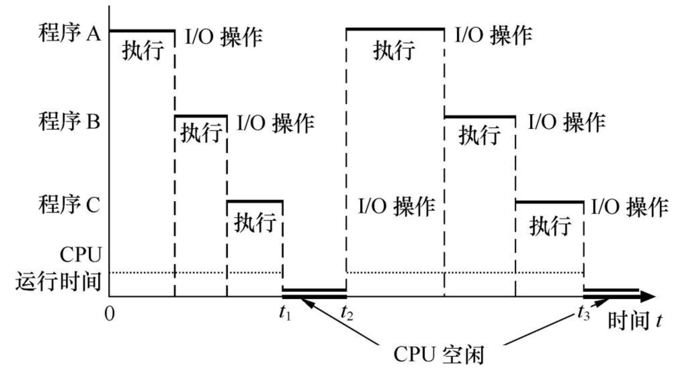

# 操作系统引论

## 操作系统的基本概念

### 定义

操作系统的定义：操作系统是计算机系统中一组控制和管理硬件资源和软件资源，合理对各类作业进行调度，以方便用户使用的程序集合。

操作系统的目标：

- 方便性：为用户提供良好、一致、易用的接口，使用户不必直接面对复杂的硬件细节。
- 有效性：合理组织计算机工作流程，管理并分配软硬件资源，提高资源利用率和系统吞吐量。
- 可扩充性：随着硬件发展和需求提升，OS 需要具备良好的结构，便于增加新功能、改进旧功能。
- 开放性：适应网络环境下的通信、协同工作、可移植性和互操作性要求。

### 作用

操作系统的作用：

- **向上层提供方便易用的服务**：作为用户与硬件之间的接口，OS 为用户提供统一接口。
- **作为系统资源的管理者**：OS 统一管理处理机、存储器、设备和文件。
- **系统软件的核心**：OS 是最基础最先装入的重要系统软件，它控制硬件工作并为其他软件提供运行环境。

> [!NOTE]
>
> 程序需要**放进内存**并**分配给它 GPU** 才能执行。

### 特征

操作系统的特征：

- 并发：两个或多个事件在同一时间间隔发生，这些事宏观上是同时发生，微观上是交替发生。
- 共享：系统中的资源可供内存中多个并发执行的进程共同使用。
  - 两种共享方式：**互斥共享方式**、**同时共享方式**
- 虚拟：把若干物理实体变成逻辑上的对应物。
  - 两种虚拟技术：空分复用技术、时分复用技术
- 异步：由于资源有限，进程的执行不是一贯到底，而是走走停停的。

> [!NOTE]
>
> 注意区分并发和并行：
>
> - 并发：计算机系统中同时运行多个程序，宏观上是同时运行，微观上是交替运行。
> - 并行：计算机系统中同时运行多个程序，宏观上和微观上都是同时运行。
>
> 单核 CPU 同一时刻只能执行一个程序 (并发)，多核 CPU 同一时刻可以执行多个程序 (并行)。

> [!NOTE]
>
> 区别两种共享方式：
>
> - 互斥：一个时间段内只允许一个进程访问该资源
> - 同时：允许一个时间段内多个进程对它们进行 (交替) 访问

## 操作系统的发展历史

### 总体演进脉络

操作系统的发展大致经历以下阶段：

1. [未配置 OS 的计算机系统](#未配置 OS 的计算机系统)
2. [单道批处理系统](#单道批处理系统)
3. [多道批处理系统](#多道批处理系统)
4. [分时系统](#分时系统)
5. [实时系统](#实时系统)
6. [微机操作系统](#微机操作系统)

### 未配置 OS 的计算机系统

工作方式：人工操作，用户通常就是程序员或操作员；使用机器语言；输入输出依赖纸带或卡片。

主要特点：

- 用户独占全机，资源不能共享，资源利用率低。
- CPU 经常等待人工装入和卸出纸带、卡片，利用率低。
- 用户需要自行编写大量与硬件相关的代码。

主要矛盾：计算机处理能力不断提升，但人工操作效率低，CPU 运算能力没有得到充分发挥。

改进方向：引入专门操作员和批处理思想。

后续改进：出现脱机输入输出（off-line I/O），先由外围机将纸带或卡片内容写到磁带，再由主机高速读入内存，减少 CPU 等待时间，提高 I/O 速度。

### 单道批处理系统

定义：将一批作业组织成作业序列，由监督程序（Monitor）自动依次处理，每次内存中只运行一道作业。

产生背景：20 世纪 50 年代末到 60 年代中期，晶体管计算机使机器更可靠，系统可连续运行更长时间。

典型特征：

- 设计、生产、操作、程序编写和维护开始明确分工。
- 使用磁带等介质组织作业。
- 可以使用汇编语言和高级语言开发程序。

优点：系统吞吐量较大，资源利用率较高。

缺点：作业周转时间长，用户无法与作业交互。CPU 和 I/O 设备忙闲不均衡。

适用场景：适合计算量大、流程固定、自动化程度高的成熟作业。

#### 单道批处理的两种形式

##### 联机批处理
- 用户通过纸带或卡片提交作业，操作员组成批作业后交给系统处理。
- 作业通常包括程序、数据以及作业控制说明。
- 问题在于慢速 I/O 仍由主机直接完成，I/O 期间 CPU 需要等待。

##### 脱机批处理
- 借助卫星机完成输入输出，主机专注计算，二者可并行工作。
- 监督程序负责装入、编译、运行等控制工作。
- 优点是提高 CPU 和 I/O 设备利用率、提升系统吞吐量。
- 缺点是磁带或磁盘仍需人工装卸，作业分类依赖人工，监督程序可能被用户程序破坏。

> **联机单道批处理系统**指主机一边连着输入输出设备，一边自己完成作业处理，主机既负责计算，也负责慢速 I/O。问题在于，当读卡、读纸带、打印结果这类慢速 I/O 发生时，CPU 常常只能等待，CPU 利用率还是不高。
>
> **脱机单道批处理系统**指把输入输出工作从主机那里分离出去，先由外围机或卫星机完成，再交给主机计算。也就是 I/O 不直接在线占着主机做，而是先离线整理好。

### 多道批处理系统

定义：在内存中同时存放多道作业，让它们共享 CPU 和其他系统资源。

基本过程：用户提交的作业先放入外存形成“后备队列”，作业调度程序按算法选择若干作业进入内存运行。

运行特征：

- 多道性：内存中同时有多个作业。
- 宏观并行：多个作业都在推进。
- 微观串行：各作业交替使用 CPU。

主要特征：多道性、无序性、调度性。

优点：CPU 和内存利用率更高，系统吞吐量更大。

缺点：用户交互性差，不利于程序调试和修改。平均周转时间较长，短作业等待时间明显增加。

> 在单道批处理中：
>
> - 内存里只有一个作业
> - 这个作业如果在等 I/O，CPU 往往就空着
>
> 在多道批处理中：
>
> - 内存里同时装入多个作业
> - 当一个作业因为 I/O 暂时不能继续运行时，CPU 就切换去执行另一个作业
> - 这样 CPU 不容易闲着，系统整体效率更高

### 分时系统

形成动力：多道批处理主要追求资源利用率和吞吐量，而分时系统主要来自用户对交互的需求。

用户需求主要包括：人机交互、共享主机、便于上机使用。

分时的含义：多个用户共享一台计算机，也可以理解为多个程序按时间片共享硬件和软件资源。

- **多个用户分时**
- 前台和后台程序分时
- 时间片 (time slice) 分配
- 抢先式分时和非抢先式分时

关键实现问题：

- 及时接收用户命令或数据。
- 及时处理用户请求，使各作业能在很短时间内轮流获得 CPU。

重要概念：

- 时间片：每个程序轮流占用 CPU 的时间。
- 抢先式：OS 强制程序让出 CPU。
- 非抢先式：程序主动让出 CPU。

分时系统特征：

- 多路性：一台主机可连接多个终端。
- 独立性：每个用户感觉像独占主机。
- 交互性：支持广泛的人机对话。
- 及时性：响应时间通常控制在用户可接受范围内，常见为 1 到 2 秒。

### 实时系统

基本要求：响应时间短，系统可靠性高。

按任务是否周期性划分：

- 周期性实时任务
- 非周期性实时任务

按截止时间严格程度划分：

- 硬实时任务：必须满足截止时间，否则后果严重。
- 软实时任务：偶尔错过截止时间影响较小。

主要特点：

- 响应迅速，通常采用事件驱动方式设计。
- 交互能力有限，往往服务于特定场景。
- 可靠性要求高，常使用双机或容错机制。

> 与批处理、分时系统相比，实时系统往往是专用系统，强调外部事件响应和高可靠性，也可与通用系统结合形成通用实时系统。

### 微机操作系统

定义：配置在微型计算机上的操作系统。

常见类型：

- 单用户单任务：一次只允许一个用户运行一个任务，代表如 `CP/M`、`MS-DOS`。
- 单用户多任务：一个用户可同时运行多个任务，代表如 `Windows`。
- 多用户多任务：多个用户通过终端共享同一系统，每个用户又可运行多个任务，代表如 `Unix`。
