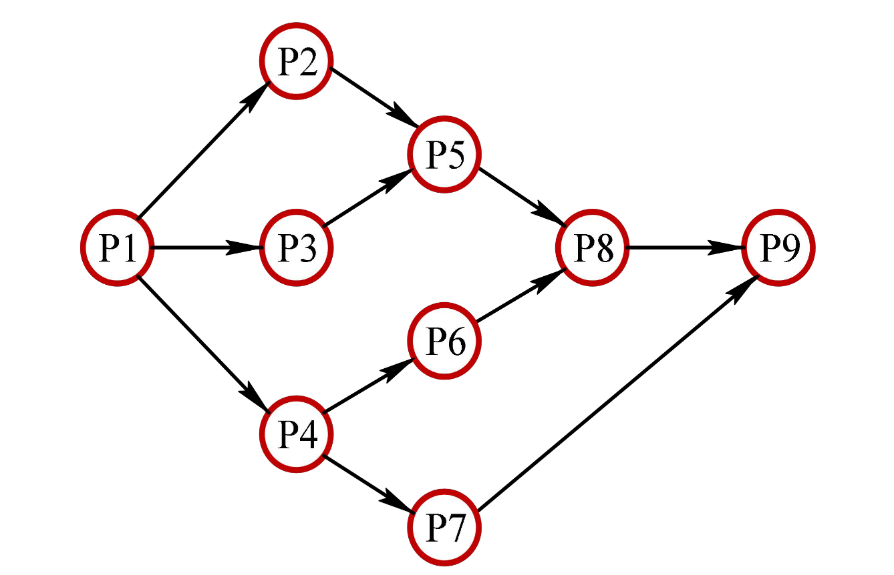
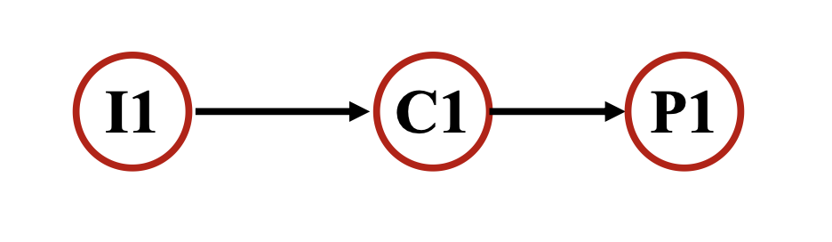
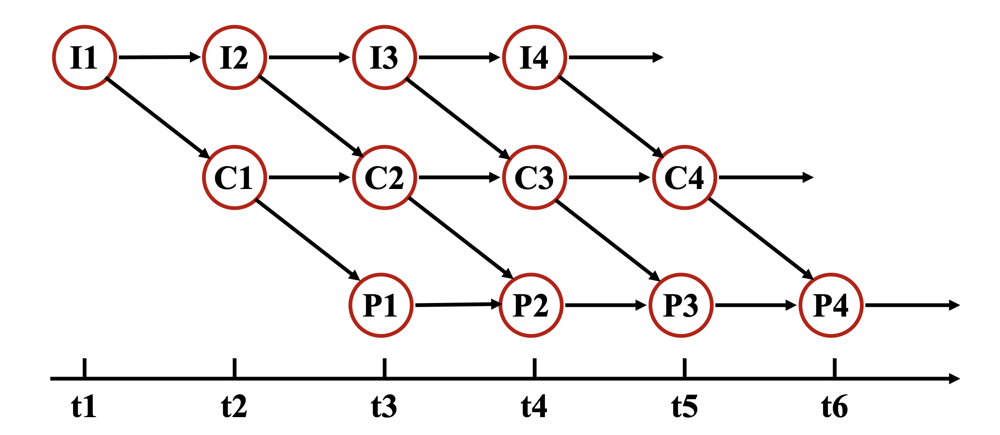
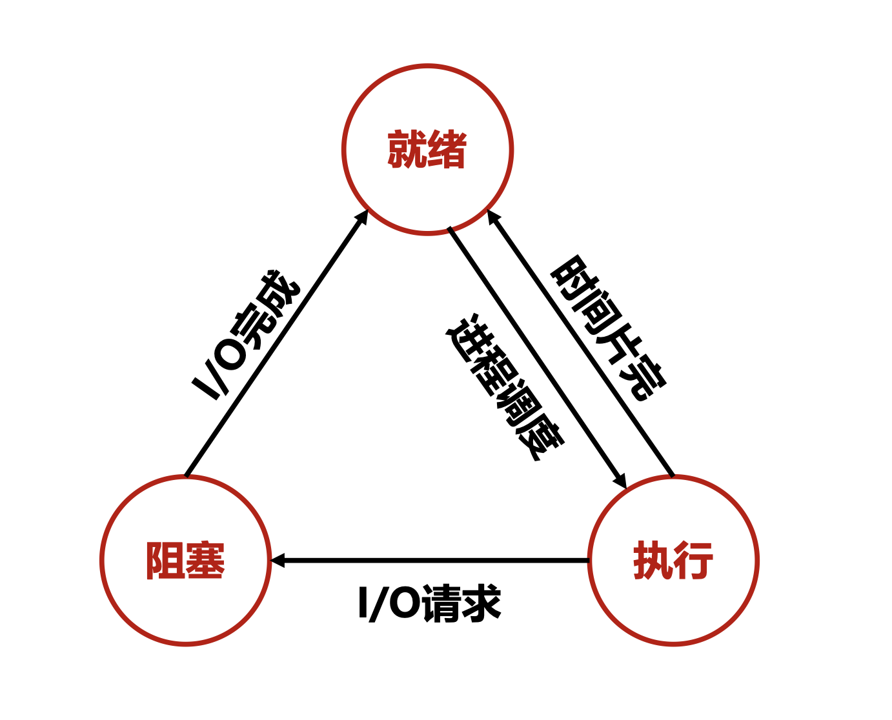
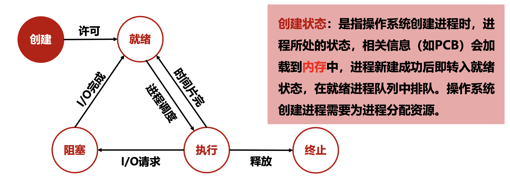
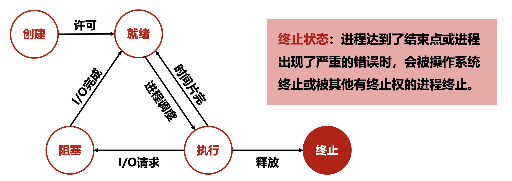
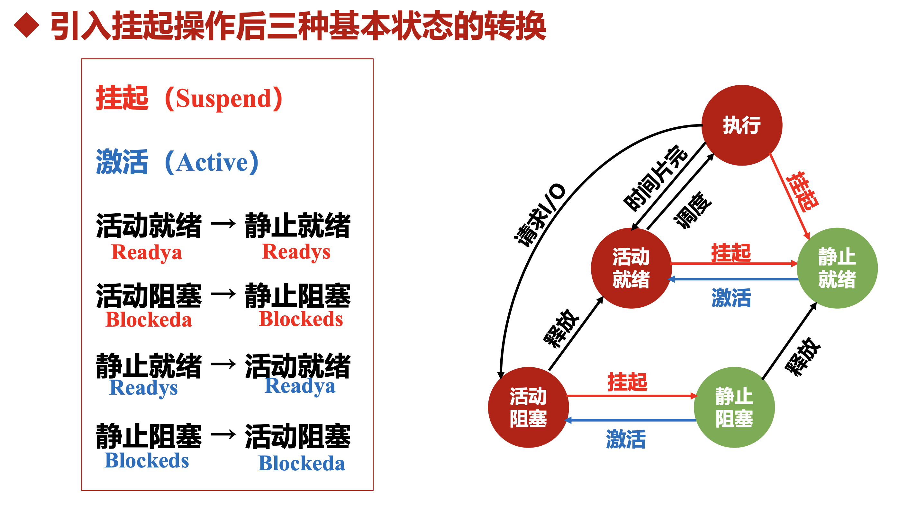
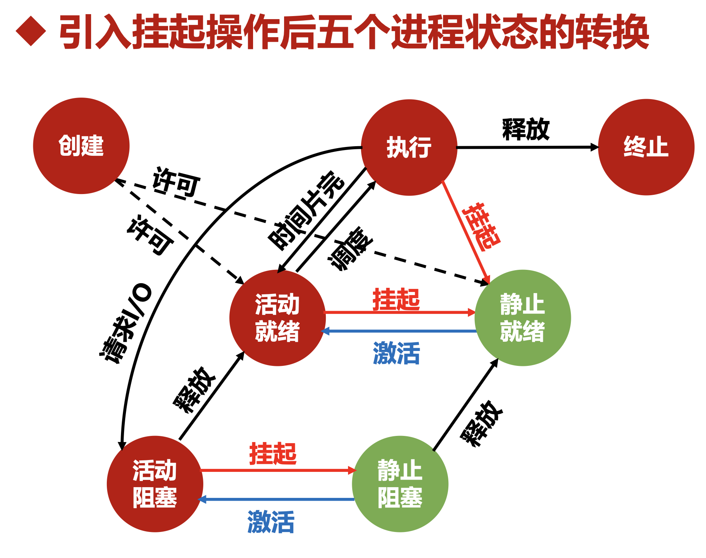

# 进程

## 前趋图和程序执行

### 为什么需要前趋图

在单道环境下，程序通常按严格顺序执行：上一段程序结束后，下一段程序才能开始。

在多道环境下，多个程序可以并发执行，共享系统资源，从而提高资源利用率和运行效率。

并发执行会带来“哪些操作必须先做、哪些操作可以同时做”的问题，前趋图就是用来描述这种先后约束关系的。

### 前趋图的定义

前趋图（`Precedence Graph`）：用于描述多个进程或多个程序段之间的执行先后关系。

- 它本质上是一个`有向无循环图`（`DAG`）。
  - `结点` 表示一个进程，或一段可以独立执行的程序段。
  - `有向边` 表示前趋关系。

### 前趋图中的几个基本概念

- 初始结点：没有前趋结点的结点，可以最先执行。
- 终止结点：没有后继结点的结点，表示执行流程的结束位置。
- 权重：某些前趋图会给结点附加权重，用来表示该结点对应程序段的执行时间或程序量。

### 顺序执行与并发执行

#### 顺序执行

定义：程序严格按照既定次序依次运行。

特点：

- 顺序性：执行次序固定。
- 封闭性：运行时通常独占资源，受外界影响小。
- 可再现性：初始条件相同，多次执行结果相同。

#### 并发执行

定义：多个程序或程序段在同一时间段内交替推进。

特点：

- 间断性：执行过程会出现“执行 -> 暂停 -> 再执行”。
- 失去封闭性：资源共享导致各程序相互制约。
- 不可再现性：执行结果可能受调度顺序影响。

## 进程的描述

### 为什么要引入进程

在多道程序环境下，程序不再像单道系统那样“独占资源并顺序跑完”，而是会和其他程序并发执行、共享资源、交替推进。为了描述这种动态执行活动，操作系统引入了**进程**概念。

### 进程与进程实体定义

#### 进程

定义：进程是程序的一次执行过程。

> [!NOTE]
>
> 进程最直接的理解是：正在运行的程序。
>
> 更准确一点说：
>
> - 程序是静态的，只是一段存放在磁盘里的代码和数据。
> - 进程是动态的，是这段程序一次实际执行的过程。
>
> 比如：
>
> - 你电脑里有一个微信安装包或微信程序文件，这叫程序。
> - 你双击打开微信以后，系统里真正开始运行的那个执行活动，就叫进程。

#### 进程实体

进程实体（也叫进程映像）通常由三部分组成：

- 程序段
- 数据段
- PCB (Process Control Block，进程控制块) : 进程相关信息

其中，PCB 是最关键的部分。创建进程时要创建 PCB，撤销进程时也要撤销 PCB。

> [!NOTE]
>
> 进程实体强调“构成进程的静态内容”，进程强调“这些内容运行起来后的动态过程”。
>
> 进程是进程实体的运行过程，也就是这个实体被 CPU 执行、被操作系统调度时表现出来的动态活动。

### 进程的特征

进程有五个特征：

- 结构性：进程不仅包含程序代码，还包含程序运行所需的数据和描述进程信息的数据结构，尤其是 PCB。
- 动态性：进程有产生、运行、暂停、终止等生命周期。这是进程最基本的特征。
- 并发性：多个进程实体可以同时驻留内存，并在一段时间内并发运行。
- 独立性：进程是独立获得资源和独立接受调度的基本单位。
- 异步性：进程按各自独立、不可预知的速度推进，这会导致执行结果可能具有不可再现性，因此 OS 必须进行协调和控制。

### 进程的三种基本状态

最基本的三种状态是：

- 就绪态：进程运行所需条件都已满足，只差处理机。它已经在内存中，等待被调度。
- 执行态：进程已经获得处理机，正在 CPU 上运行。
- 阻塞态：进程因等待某个事件发生而暂时不能运行，例如等待 I/O 完成。

### 进程的两种常见状态

除了上面三种基本状态，进程还有两种常见状态：

- 创建态：操作系统正在创建进程，装入相关信息并分配资源。创建成功后通常进入就绪态。
- 终止态：进程执行结束，或因严重错误被操作系统或其他有权限的进程终止。随后系统回收资源并删除该进程。

### 为什么要引入挂起操作

课件给出引入挂起（Suspend）操作的几类原因：

- 系统资源的需要：当内存紧张，而系统中又没有可运行的就绪进程时，可以把某些阻塞进程换出到外存，腾出内存空间。
- 调节竞争或消除故障的需要：当系统怀疑某些进程引发资源竞争或故障时，可以先挂起这些进程。
- 终端用户的需要：用户在调试、检查、修改程序时，可能需要先暂停进程。
- 父进程的需要：父进程在控制、检查、修改子进程时，可能需要挂起子进程。
- 调节进程的需要：某些周期性执行的进程在未到执行时间前可以先挂起，减轻内存负担。

## PCB

### PCB 的定义

PCB 是对进程本质属性的描述，是操作系统管理进程所需要的基本信息。

- 每个进程都有进程快
- 进程块中的信息是动态变化的

### PCB 的作用

PCB 的作用：

- 作为独立运行基本单位的标志
- 能实现间断性运行方式
- 提供进程管理所需要的信息
- 提供进程调度所需要的信息
- 实现与其他进程的同步与通信

### PCB 中的信息

PCB 中的信息：

- 进程标识符
- 处理机上下文
- 进程调度信息
- 进程控制信息

### PCB 的组织方式

PCB 组织方式：

- 线性方式
- 链接方式
- 索引方式

