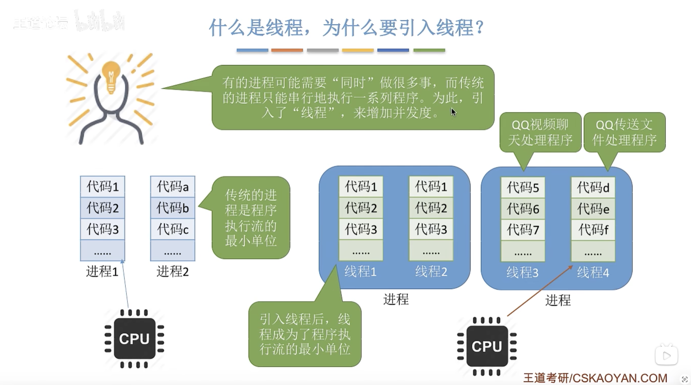
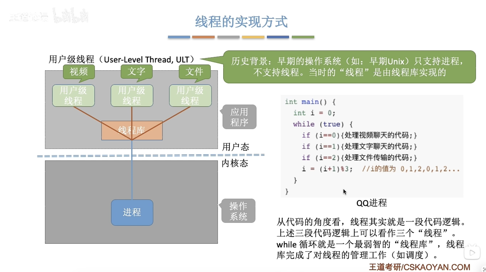

# 线程

## 为什么要引入线程

**引入线程之后，不仅进程之间可以并发执行，进程内部也可以并发执行**。

## 什么是线程

线程：线程是 CPU 的最小执行单元。

线程的属性：

- 线程是处理机调度的单位
- 多 CPU 计算机中，各个线程可以占用不同的 CPU
- 每个线程都有一个线程 ID 和线程控制块 (TCB)
- 线程也有阻塞、就绪、运行三种状态
- 同一进程的不同线程之间共享进程的资源

## 线程的实现方式

### 用户级线程

特点：

- 线程的管理工作由用户完成
- 线程的切换不需要操作系统干涉
- 操作系统意识不到用户级线程的存在

优点：

- 用户级线程在用户空间就可以完成，不需要切换到核心态，线程管理的开销小

缺点：

- 当一个用户线程被阻塞，整个进程都会被阻塞，并发度不高
- 多个线程不能在多核处理机上并行运行

### 内核级线程

特点：

- 线程的管理工作由内核来完成
- 线程的切换由操作系统进行
- 操作系统能够意识到线程的存在

优点：

- 进程中其中一个用户线程被阻塞了，别的用户线程还能继续执行，并发能力强
- 多线程能够在多核处理机上并行运行

缺点：

- 一个进程通常占用多个内核级线程，内核线程切换由系统内核完成，线程管理的成本高

> [!NOTE]
>
> 一对一模型：一个用户级线程映射到一个内核级线程。

### 组合线程模型

